# Design

We have the following assumptions:
1. We assume that during a crash, all data on a CM is lost. This necessitates that at least one CM is alive at a time in our system. 
2. We use an assumption similar to that used for the Bully Algorithm. Messages must be delivered and responded to within a bounded time. If a CM is alive, it is **guaranteed** to receive a given message and respond within a given time, otherwise it is guaranteed to be a dead CM.
3. Fault tolerance only applies to the central manager, not the hosts. If a host crashes, the system may be unable to progress.

## Consensus Model
The central managers operate in a **primary-backup model**. For fault tolerance, they rely on an election algorithm to elect the primary, and this election is initiated by a host.
- Whenever the primary receives a read request (RQ), a write request (WQ), a read confirm (RC) or a write confirm (WC), it forwards this message along with its current records of page owners and copysets to the backup.
	- If the primary goes down, the backup possesses enough information to perform actions that do not violate the needs of Ivy.
- In addition to the above protocol, the hosts now perform retransmissions. Upon timeout of the following messages, the host calls for an election among the CMs, and retransmits its original message (with the same request ID) after a CM has been elected.
	- When sending a read request `RQ`, the host expects a page to be sent from the owner node (a `RP` message). Otherwise, it assumes that the primary CM went down and didn't send the RF to the owner. 
	- When sending a read confirm `RC` to confirm reception of the page, the host now expects an acknowledgement `RC_ACK` from the primary CM. Otherwise, it assumes that the primary CM went down, and does not know that the request has been completed.
		- We need to know if a request is still in progress (and we need both CMs to be aware of this), to ensure that requests are handled one-by-one.
	- When sending a write request `WQ`, the host expects a page to eventually be sent from the owner node (a `WP` message). Otherwise, it assumes that the primary CM went down, and didn't send the WF to the owner (and didn't send the invalidations).  
	- When sending a write confirm `WC` to confirm reception of the page, the host now expects an acknowledgement `WC_ACK` from the primary CM. Otherwise, it assumes the primary CM went down, and does not know that the write request has been completed.
- The election algorithm is a modified Bully algorithm, where in our case the coordinator (the primary CM) ==does not relinquish control== if it is already the primary.
	- Elections are initialised by a CM receiving an `ELECTION_START` message from a host -- this indicates that the host cannot reach the primary CM and wants the CMs to decide among themselves on who the primary should be.
	- Upon receiving this message, the CM only starts a full election if it itself is a backup. ==If the CM is a primary, it asserts its own victory by broadcasting an `ELECTION_WIN` message==.
	- If the CM is a backup, it sends an `ELECT_ME` self-election message to the other CM. This is simultaneously a check to see if the primary CM is alive, and a check to see if the other CM is the primary or has a higher ID.
	- Upon receiving an `ELECT_ME` message from the other CM:
		- If the receiver is a primary, it rejects the self-election with an `ELECT_NO` message.
		- Otherwise, the receiver only rejects the self-election if its ID is larger than the sender. Hence, the Bully Algorithm is only used to decide who the primary should be among backups (i.e. when no primary exists).
		- Note that in the implementation, we use negative IDs for CMs -- hence "CM-1" will have a higher ID than "CM-2".
	- During an election, if a backup CM does not receive any `ELECT_NO` messages for its self-election, it automatically wins.
		- This is where assumption (2) is key -- we assume that the other CM, if it is alive, **will** receive the message within the timeout period and respond with an `ELECT_NO` if it is a primary or *should* be the primary.
	- Upon becoming a primary, the CM broadcasts an `ELECTION_WIN` message to all hosts.
- Upon winning an election, the newly-elected primary simply waits for any retransmissions.
	- It knows the most recent state of the system before the primary went down. 
	- If the primary had forwarded a read request or write request, the new primary knows the request ID it should be waiting for. It drops all incoming requests, except for the one with the same request ID as the request it is waiting for.
		- This is the retransmission of the original message prior to the primary's crash.
		- Any previously dropped messages will then be retransmitted (after the election)
			- This is why we assert that the primary does not relinquish control. Since every retransmission is preceded by a call to start an election, the primary is able to immediately assert its victory and stay as the primary while it handles the ongoing request.
			
## CM States
This is a rough outline of what the CM does in either mode.
- **Start Up**: Set state to **Backup Mode**, start an election by sending `ELECT_ME` to the other CM.
- **Primary Mode**: Operate as the primary -- handling requests from hosts and sending updates to the backup.
	- **Receive RQ**: 
		1. If currently `RQ_PENDING`, drop if the request ID doesn't match.
		2. Send **`RQ_RECV`** to other CM. 
		3. Set `RQ_PENDING` and update copy set.
		4. Send `RF` to owner.
	- **Receive RC**: 
		1. Send **`RC_RECV`** to other CM. 
		2. Clear `RQ_PENDING`. 
		3. Send `RC_ACK` to reader.
	- **Receive WQ**: 
		1. If currently `WQ_PENDING`, drop if the request ID doesn't match.
		2. Send **`WQ_RECV`** to other CM. 
		3. Set `WQ_PENDING` and send invalidations, clearing copy set only after that.
		4. Send `WF` to owner after copy set is clear.
	- **Receive WC**: 
		1. Send **`WC_RECV`** to other CM. 
		2. Clear `WQ_PENDING`, set new owner. Also, clear copy set since this is only receivable if we have sent out the invalidations.
		3. Send `WC_ACK` to writer.
	- **Receive `ELECTION_START`**: Send `ELECTION_WIN` to sender.
	- **Receive `ELECT_ME` from other CM**: Respond with `ELECT_NO`, and send a state update.
	- **Receive `RQ_RECV/RC_RECV/WQ_RECV/WC_RECV`**: This should never occur, since these should only be sent by a primary CM to a backup CM -- in our implementation, both the program and the programmer panic.
- **Backup Mode**: Maintain state
	- **Receive `RQ_RECV`**: Set `RQ_PENDING` and update copy set.
	- **Receive `RC_RECV`**: Clear `RQ_PENDING`.
	- **Receive `WQ_RECV`**: Set `WQ_PENDING`.
	- **Receive `WC_RECV`**: Clear `WQ_PENDING`, clear copyset, set new owner.
	- **Receive `ELECT_ME`**: Other CM is a backup. We invoke the original Bully algorithm, since we're not a primary either.
		- If self ID is larger, respond with `ELECT_NO` and send a state update.
		- If self ID is smaller, do not respond.
	- **Receive `ELECTION_START`**: Send `ELECT_ME` to other CM.
		- **Timeout**: Send `ELECTION_WIN` to all other nodes, change state to **Primary Mode**.
		- **Receive `ELECT_NO`**: Other CM is the primary, stay as backup.
	- **Receive `CM_UPDATE` (state update)**: Update page records. 
	- **Receive RQ/RC/WQ/WC**: This should never occur, since these should only be sent by the host to the primary CM -- in our implementation, both the program and the programmer panic.
	

---

Next, we will concretely break down the various sequence diagrams to prove that the design works.
   
## Election Sequence Diagram
This shows the sequence for an election, which is triggered by a timeout occurring at the client. 

### Standard Crash
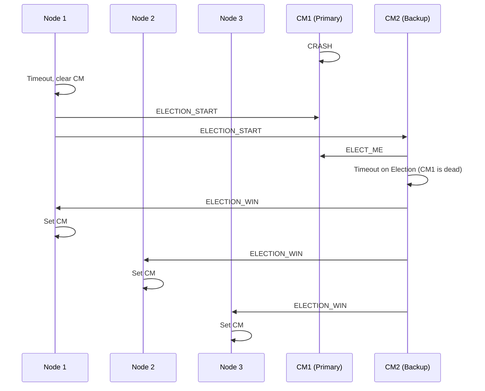

### False Timeout
Here, we show the sequence diagram when an election is initiated by a client when the primary still is alive.

In this case, a node's request has been dropped by the primary CM as the CM is currently handling another request. 

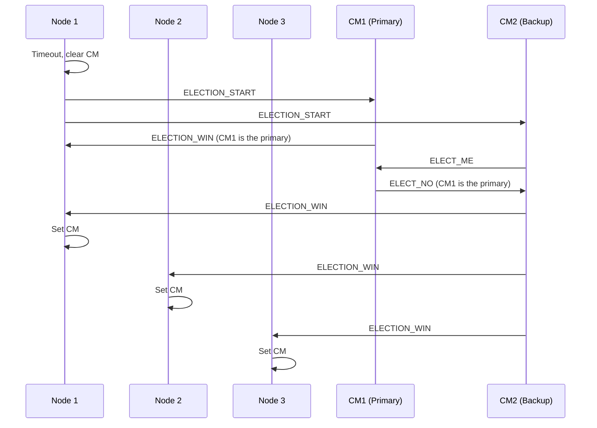

### Initialisation
Here, we show the sequence diagram at the start: Both CMs start off as backups and must decide who is the primary.

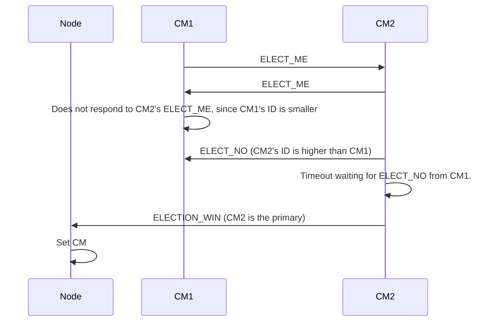

Note that in the actual program, we use negative IDs for CMs, hence "CM-1" will win over "CM-2".

## Read Sequence Diagram
This shows the standard sequence for a read request.

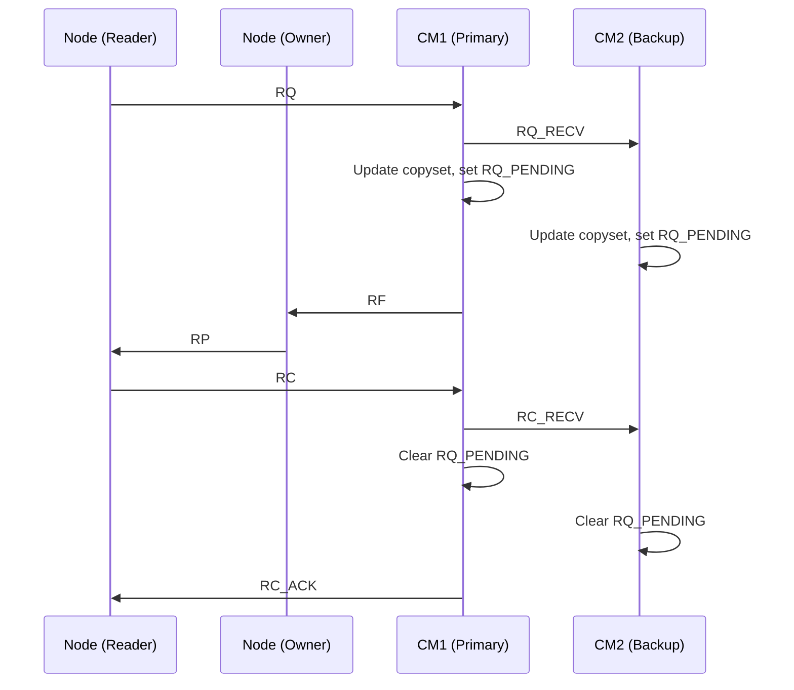

When considering cases, we can see three possibilities:
- **Case 1**: CM crashes before sending the forwarded request, `RQ_RECV`.
- **Case 2**: CM crashes after sending the forwarded request, *before* sending read-forward `RF` to the owner.
- **Case 3**: CM crashes *after* sending `RF`, before sending `RC_ACK`.

### Case 1: CM Crashes before sending `RQ_RECV`
In this case, `RQ_PENDING` won't be registered by the replica. This relies on the client starting an election, then sending a retransmission.

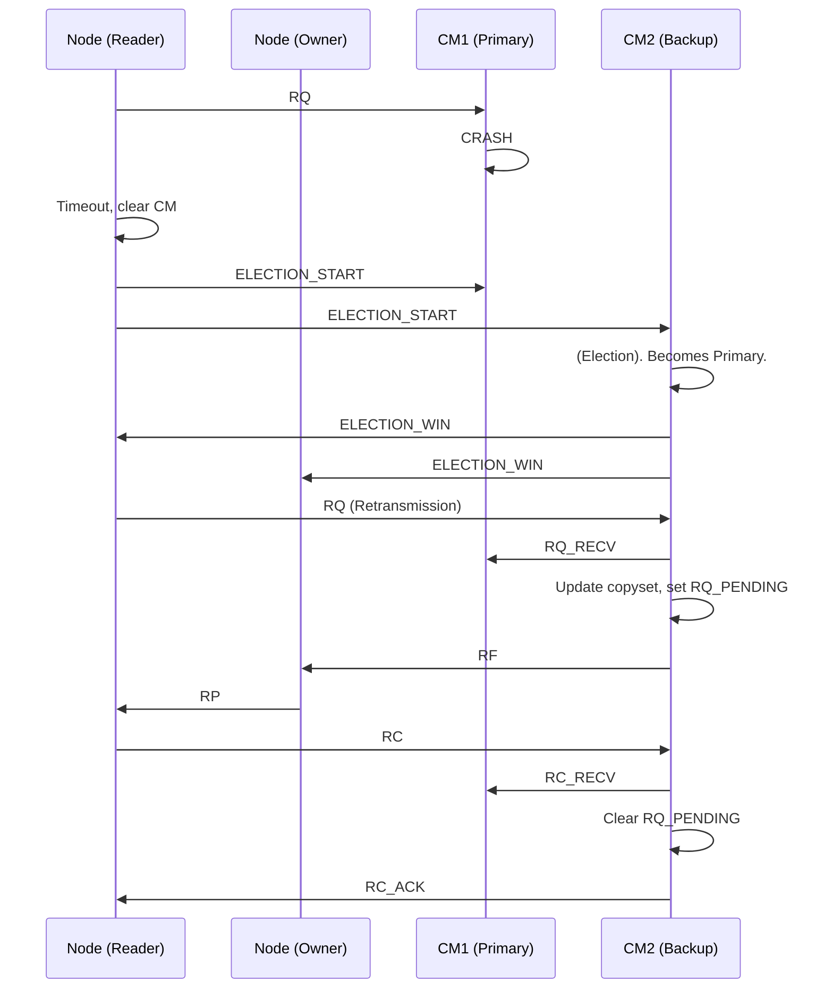

### Case 2: CM Crashes after sending `RC_RECV`, before sending `RF`
In this case, `RQ_PENDING` will be registered by the replica. The replica, after winning the election, will wait to receive a retransmission from the reader.

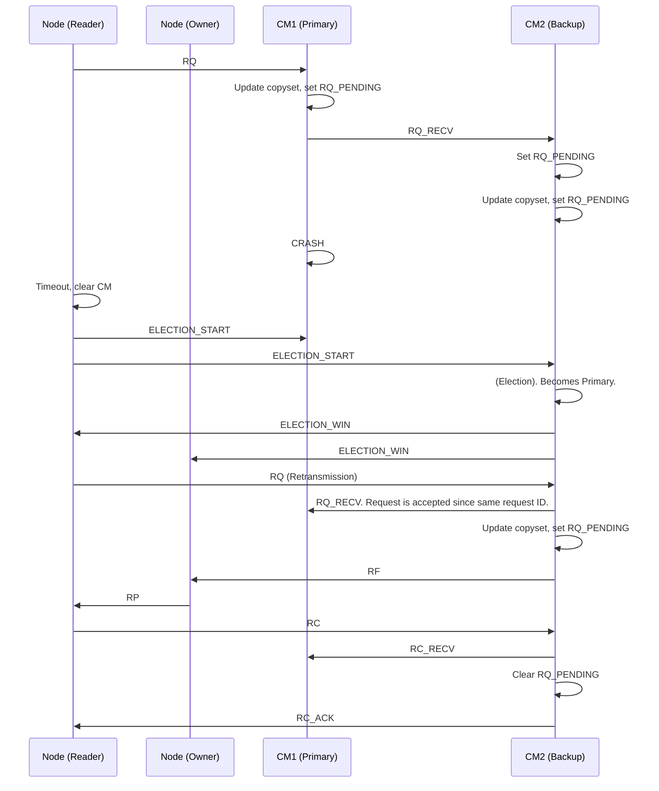

### Case 3: CM Crashes after sending `RF`
In this case, `RQ_PENDING` will be registered by the replica. The new primary **cannot** differentiate between this case and Case 2. However, it doesn't matter.
- If `RF` wasn't sent by the original primary, then the client will send a retransmission of their `RQ`, which the primary is already waiting for.
- If `RF` *was* sent by the original primary, then the client will have sent an `RC` which failed to reach the original primary. Upon timeout waiting for `RC_ACK` from the primary, the client will then send `RC` to the new primary allowing for `RQ_PENDING` to be cleared.

This case shows the second scenario.

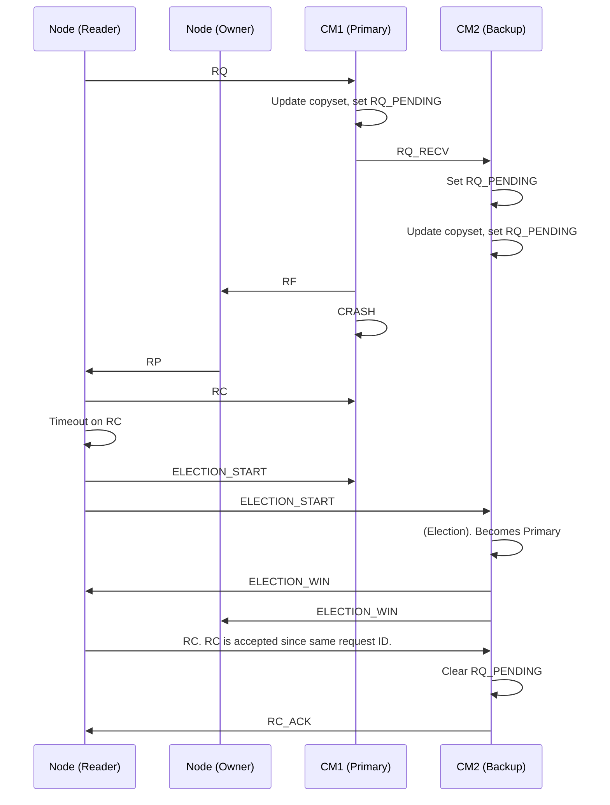

## Write Sequence Diagram
The write sequence follows a similar model.

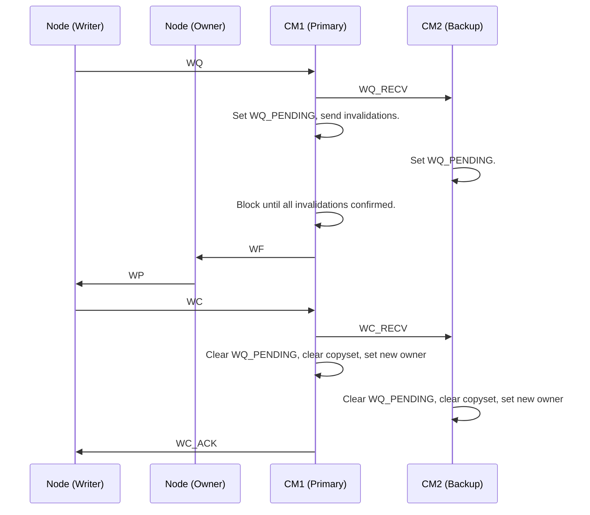

As with before, we can break this down into cases.
- **Case 1**: CM crashes before sending the forwarded request, `WQ_RECV`.
- **Case 2**: CM crashes *after* sending the forwarded request `WQ_RECV`, *before* sending the write-forward message to the owner, `WF`.
- **Case 3**: CM crashes *after* sending `WF`, before sending `WC_ACK`.

Cases 1 has a similar sequence as Case 1 in the read sequence diagram.

Case 2, however, brings the complication of the invalidation messages.
- **Case 2a**: CM crashes before sending invalidations.
- **Case 2b**: CM crashes before receiving all invalidation-confirms.

Although the new primary cannot fully distinguish between either case, we can reason that there is no need for this differentiation. 
- In either case, the new primary's copyset is set by the initial `WQ` -- this is the copy set of the page as of the reception of the write request.
- There is no way for another node to sneak into the copyset, as once `WQ_PENDING` is registered on the replica, any other requests are ignored until the original write request is completed.
- Hence, the new primary can simply re-send any invalidation messages. A client, upon receiving an invalidation, will acknowledge it even if the page is already invalidated for it.

We show that these two cases are equivalent in the next two diagrams.

### Case 2a: CM Crashes before Sending Invalidations
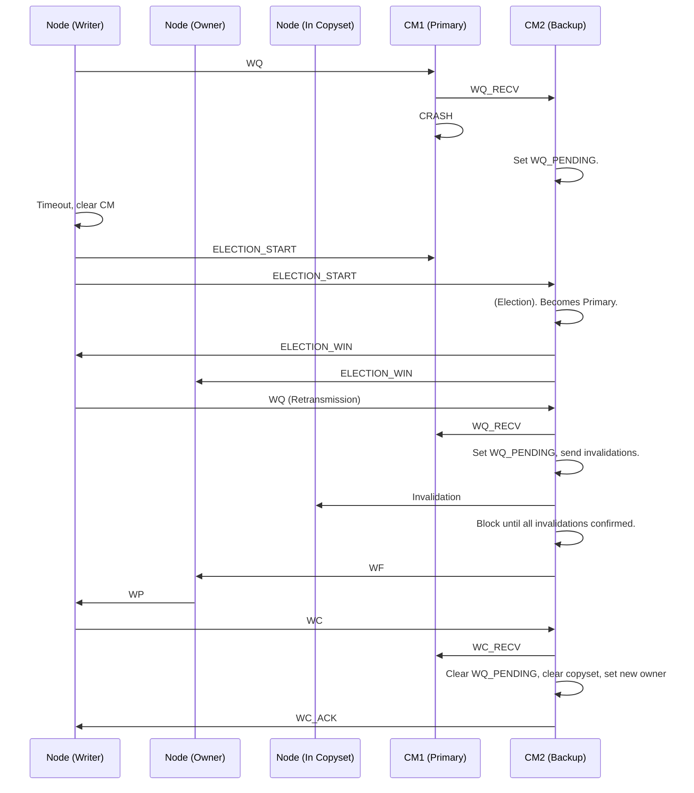

### Case 2b: CM Crashes before Receiving all Invalidate-Confirms

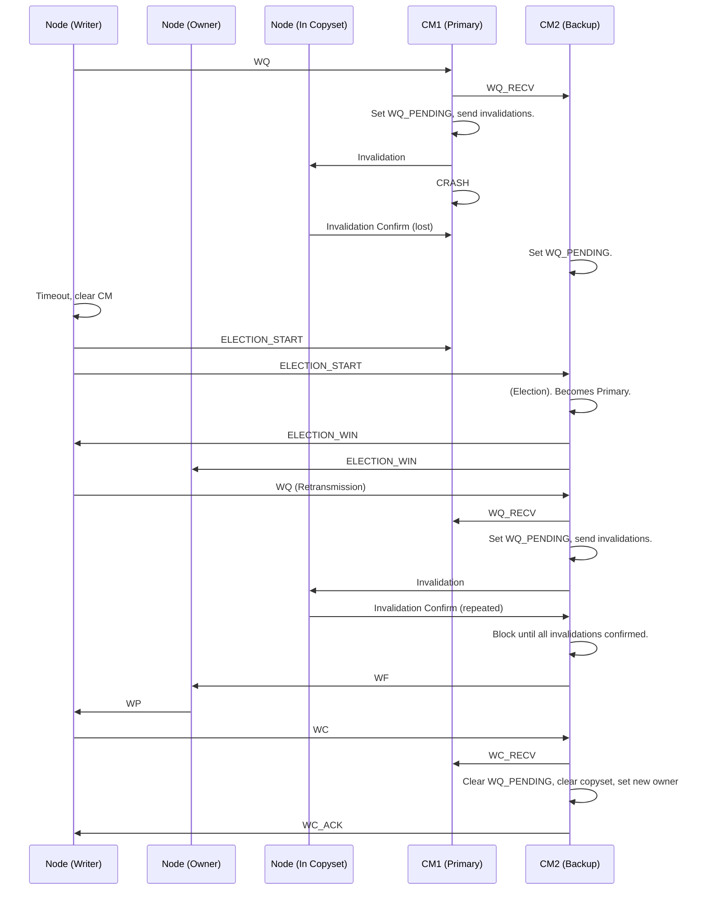

### Case 3: CM crashes *after* sending `WF`, before sending `WC_ACK`
As with Case 3 of the read sequence diagram, when the writing client receives the write-forward, it sends a write-confirm `WC` to the CM and expects a `WC_ACK`.
- When this timeouts due to a primary crash, an election is initialised.

Although the replica cannot distinguish between Cases 2 and Case 3, just as with the read sequence diagram, it doesn't have to.
- If the new primary receives a `WQ`, it simply re-invalidates all nodes in its copyset before sending the `WF`.
- If the new primary receives a `WC`, it **knows** that some time in the past, a `WF` *had* to have been sent to trigger the `WC` from the client.
	- Further, it knows that the `WC` corresponds to the current write request due to the request ID.
	- Hence, it can simply clear its copyset.

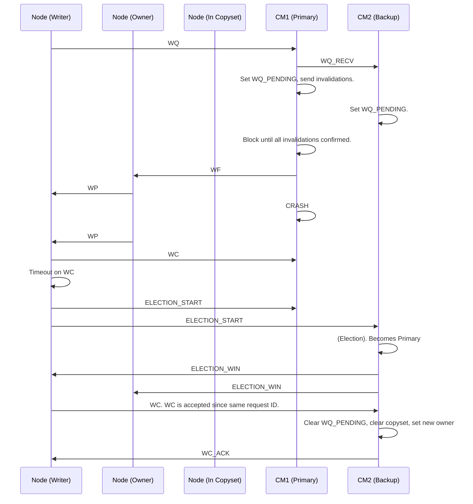

---

## Sequential Consistency
In sequential consistency, all machines observe writes according to **some** total order, which is the same across all machines.

In the non-fault-tolerant model, this is enforced by the central manager. The central manager ensures that only one node can be a writer at a time, and hence the order of writes is dictated entirely by the central manager. All hosts in the system observe these writes according to the order dictated by the CM.

In our fault-tolerant model, we first ensure that among central managers, **there can only be one ongoing request at a time**. 
- This is enforced by the `RQ_PENDING`/`WQ_PENDING`/`IDLE` state among the central managers and the request ID.
- Upon the primary failing, the backup takes over with full awareness of the same state.

We assume two requests WQ1 and WQ2.
- Both requests will have differing request IDs.
- There are three possible cases:
  1. Both requests reach the primary.
  2. WQ1 reaches the primary, the primary fails, then after the election WQ2 reaches the new primary.
  3. The primary fails. After the election, both requests reach the new primary.
  
In both cases 1 and 3, the current primary has no ongoing request. Since the primary handles requests sequentially through a Go channel, if WQ1 is received first, WQ2 will never be processed until WQ1 has been completed (that is, after receiving a write confirm for WQ1). There is a similar logic, if WQ2 is received first.
- Hence, in cases 1 and 3, the system remains sequentially consistent -- the current primary dictates the write order.

In case 2, we need to observe the individual requests.
1. WQ1 reaches the primary. The primary then sends a WQ_RECV to the backup, before crashing.
   - If the primary fails before sending the WQ_RECV, then this is case 3.
2. Since the backup receives WQ_RECV, when it becomes the primary, it will drop any further requests until it receives the retransmission for WQ1.
   - While the new primary is handling WQ1, it will not process WQ2 until WQ1 has been completed (that is, after receiving a write confirm for WQ1).
   
Hence, in all three cases, the system remains sequentially consistent. Write order is dictated by the current primary. All hosts observe writes in this order.

Hence, our fault-tolerant system is sequentially consistent.
